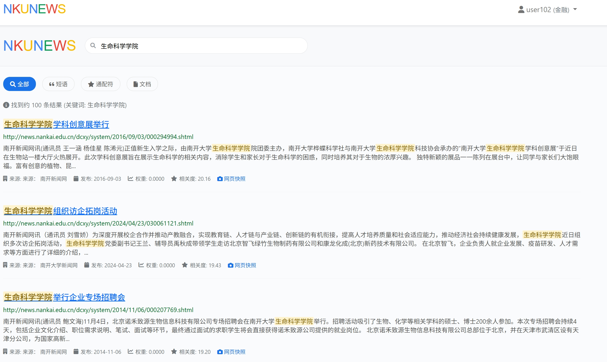

# 南开新闻搜索引擎 (NKUNEWS)

基于Whoosh和BM25算法的南开大学校内新闻搜索引擎，支持个性化搜索和时效性排序。

本项目在期末加急实现，参考了很多前人学长学姐的经验，终于在ddl前堪堪完成了作业要求（我那又有并行程序设计又有信息检索系统原理又有数据库大作业的第四学期。。。。）


---


## 功能概览

### 核心功能

* **多类型搜索**

  * 基础搜索

  * 短语搜索

  * 通配符搜索（使用 `*`、`?`）

  * 文档搜索（支持 PDF、DOC、XLS 等）


* **个性化推荐**
  * 基于用户学院信息的静态 BM25 兴趣映射
* **时效性排序**
  * 尽可能显示近期内容，不然可能全是陈年新闻
* **PageRank 算法**
  * 基于链接分析的网页权重评估

### 高级功能

* **搜索历史**：记录并展示用户历史检索

* **网页快照**：查看新闻页面历史版本

* **搜索建议**：输入提示与联想
* **用户系统**：注册/登录、关联学院、个性化设置
* **文档检索**：多格式文件检索与下载

---

## 技术栈

* **后端**

  * Python 3.8+
  * Flask
  * MongoDB / GridFS
  * Whoosh（全文检索）
  * Jieba（中文分词）
* **前端**

  * Bootstrap 5
  * JavaScript 
* **检索算法**

  * BM25F（多字段最佳匹配）
  * PageRank
  * 个性化 & 时效性评分

---


## 模块结构

```
hw4_web_searchengine/
├── spider/                # 爬虫模块
│   ├── newsspider_pagerank.py
│   └── file_scraper.py
├── templates/             # HTML 模板
│   ├── base.html
│   ├── index.html
│   └── search.html
├── static/                # 静态资源
│   ├── css/
│   ├── js/
│   └── images/
├── whoosh_index/          # 索引目录
│   ├── news/
│   └── documents/
├── search_engine.py       # 核心应用
├── build_whoosh_index.py  # 索引构建脚本
├── run.py                 # 启动入口
├── requirements.txt       # 依赖列表
└── README.md              # 项目说明
```

---

## 实现过程

### 数据爬取与存储
参照之前的学长学姐的实现方法，我们采用mongoDB数据库来实现数据储存，我们设计的集合如下：

* 爬取来源：

  * `https://news.nankai.edu.cn`
  * `https://jwc.nankai.edu.cn`
  * `https://www.nankai.edu.cn`
  * `https://zsb.nankai.edu.cn`
* 使用 MongoDB 存储原始数据，GridFS 存放附件

爬虫运行了43h，爬取到数据大约10w+


* 由于原始的数据较为驳杂，我们又专门提取了1W+条新闻数据来补充，其中一条数据如下：
 
### 索引构建
按照原定计划我们本来应该使用ES作为引擎来构建框架，但由于这个东西需要配置java等一系列的东西非常的复杂，我们由了解到使用jieba的ChineseAnalyzer中文分词器对MongoDB中的内容进行分词，并构建Whoosh索引 也能达到类似的效果并且还可以实现纯python环境，于是我们选择了whoosh来构建索引，即使它可能比ES要慢一些。


* **索引目录**
* 
```python
  def _create_index_directories(self):
        """创建索引目录"""
        for dir_path in [self.index_dir, self.news_index_dir, self.documents_index_dir]:
            if not os.path.exists(dir_path):
                os.makedirs(dir_path)
                logging.info(f"创建目录: {dir_path}")

```


* **新闻索引**

  ```python

    def create_news_schema(self):
        """创建新闻索引结构"""
        analyzer = ChineseAnalyzer()
        return Schema(
            id=ID(stored=True, unique=True),
            url=ID(stored=True),
            title=TEXT(stored=True, analyzer=analyzer, phrase=True),
            content=TEXT(stored=True, analyzer=analyzer, phrase=True),
            source=TEXT(stored=True, analyzer=analyzer, phrase=True),
            date=DATETIME(stored=True),
            created_at=DATETIME(stored=True),
            pagerank=NUMERIC(stored=True, decimal_places=8),
            snapshot_hash=ID(stored=True),
            attachment_count=NUMERIC(stored=True)
        )

    
  ```

* **文档索引**

  ```python
  def create_documents_schema(self):
        """创建文档索引结构"""
        analyzer = ChineseAnalyzer()
        return Schema(
            id=ID(stored=True, unique=True),
            url=ID(stored=True),
            title=TEXT(stored=True, analyzer=analyzer, phrase=True),
            file_name=TEXT(stored=True, analyzer=analyzer, phrase=True),
            file_type=ID(stored=True),
            file_size=NUMERIC(stored=True),
            fetched_at=DATETIME(stored=True),
            gridfs_id=ID(stored=True)
        )
  ```

### 搜索引擎构建

这部分写的比较难绷，感觉确实起到了给不同用户提供不同东西的用途，但是感觉其实不太个性来着，对于金融学院和计算机学院的学生搜索投资，能够获得不同的效果，计算机学院学生将会获得以下排序的网页。


而金融学院学生会得到如下排序网页：


#### 核心算法实现

* **BM25F多字段评分**
  
  
  ```python
  # 基础BM25分数计算
  base_score = searcher.score_docs(results)
  
  # 多字段权重：标题权重最高，内容次之，来源最低
  field_weights = {
      'title': 3.0,
      'content': 1.0, 
      'source': 0.5
  }
  ```

* **个性化评分机制**
  
  根据用户的学院信息，对不同类型的新闻给予不同的权重加成。比如计算机学院的同学搜索时，包含"AI"、"算法"等关键词的新闻会得到更高的分数：
  
  ```python
  def calculate_personalized_score(content, user_college):
      keywords = college_keywords.get(user_college, [])
      score = 0
      for keyword in keywords:
          if keyword in content:
              score += keyword_weights.get(keyword, 1.0)
      return min(score, 5.0)  # 防止分数过高
  ```

* **最终评分公式**

  ```python
  final_score = (
      personalized_score * 0.4 +   
      time_score * 0.3 +            
      pagerank * 10 * 0.2 +         
      base_score * 0.1              
  )
  ```

* **学院兴趣映射**

  | 学院  | 关键词示例                           |
  | --- | ------------------------------- |
  | 计算机 | 计算机、软件、人工智能、算法、编程、数据、网络、AI、机器学习 |
  | 金融  | 金融、经济、银行、投资、股票、基金、证券、货币、财经、市场   |
  | 生物  | 生物、细胞、基因、DNA、生态、进化、医学、植物、动物     |

* **时效性评分**


  | 时间范围   | 分数  |
  | ------ | --- |
  | 1 天内   | 1.0 |
  | 1 周内   | 0.9 |
  | 1 月内   | 0.8 |
  | 3 月内   | 0.6 |
  | 1 年内   | 0.4 |
  | 超过 1 年 | 0.2 |

#### 高级搜索功能

* **短语搜索**：用双引号包围的关键词会被当作完整短语处理
* **通配符搜索**：支持 `*` 和 `?` 通配符，满足各种奇葩搜索需求
* **搜索建议**：基于历史搜索记录和热门关键词的自动补全
* **搜索历史**：每个用户的搜索记录都会保存，方便回顾

### Web前端设计

前端这块确实不太会（），基本上就参考前人经验和gpt修修改改了，大概做的比较少，报告效果看起来还不错。

#### 整体设计理念

* **简洁**：参考了Google和百度的搜索页面设计，主页就一个搜索框，简单粗暴
* **响应式布局**：使用Bootstrap 5确保在各种设备上都能正常显示
#### 页面结构

* **主页 (index.html)**
  ```html
  <div class="search-container">
      <h1 class="logo">NKUNEWS</h1>
      <form class="search-form">
          <input type="text" class="search-input" placeholder="搜索南开新闻...">
          <button type="submit" class="search-btn">搜索</button>
      </form>
  </div>
  ```

* **搜索结果页 (search.html)**
  
  这个页面是最复杂的，需要展示搜索结果、分页、筛选条件等：
  
  ```html
  <div class="results-container">
      <div class="search-stats">找到约 {{total}} 条结果</div>
      
      <div class="result-item">
          <h3 class="result-title">
              <a href="{{result.url}}">{{result.title|safe}}</a>
          </h3>
          <p class="result-snippet">{{result.content|safe}}</p>
          <div class="result-meta">
              <span class="result-source">{{result.source}}</span>
              <span class="result-date">{{result.date}}</span>
              <a href="/snapshot/{{result.id}}" class="snapshot-link">网页快照</a>
          </div>
      </div>
      
  </div>
  ```

#### 交互功能

* **高亮关键词**：搜索结果中的关键词会被高亮显示
* **分页功能**：支持搜索结果分页显示，避免一次性加载太多内容
* **用户系统**：登录后可以查看个性化推荐和搜索历史


## 项目总结

### 完成情况

前前后后改了很多版本，尤其是爬取数据时等待时间确实特别漫长，主要之前出现过爬取的文件名全是乱码导致完全无法根据文件名构建索引的问题，这个模块又比较花时间，不过好在是借鉴前人经验完成了

✅ **基础搜索功能**：支持关键词搜索、短语搜索、通配符搜索  
✅ **个性化推荐**：基于用户学院的兴趣映射  
✅ **时效性排序**：优先展示最新新闻  
✅ **PageRank算法**：提高搜索结果的权威性  
✅ **用户系统**：注册登录、搜索历史  
✅ **文档检索**：支持PDF、DOC等文件搜索  
✅ **网页快照**：查看历史版本  
✅ **web前端**：适配不同设备  

### 技术收获

1. **全文检索技术**：从零开始学习了Whoosh的使用，理解了倒排索引的原理
2. **算法实现**：亲手实现了BM25、PageRank等经典算法，不再是纸上谈兵
3. **中文分词**：深入了解了jieba分词的原理和使用方法
4. **Web开发**：Flask框架的使用，前后端交互的实现
5. **数据库操作**：MongoDB的使用，GridFS存储大文件的方法

### 踩过的坑

1. **编码问题**：中文处理各种乱码，最后统一用UTF-8解决


### 不足与改进

虽然项目基本完成了，但还有很多可以改进的地方：

1. **搜索精度**：BM25算法的参数还可以进一步调优，其实可以参考一些人工智能或者自然语言处理的方法进行推荐
2. **知识图谱**：可以尝试像百度那样，搜索一些简单的问题
3. **搜索速度**：在大数据量下还是有点慢，可以考虑引入缓存机制
4. **用户体验**：搜索建议、历史记录等功能还可以更智能化


总之，通过一个月断断续续的work，我们终于是从零开始构建了一个搜索引擎，**congratulations！**

---

